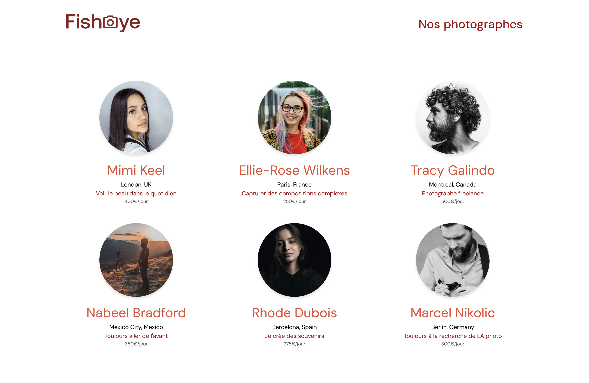

# Fisheye

Fisheyes is a platform for photographers to show their work. We had to create this platform. The application consisted of a home page that showcased all the photographers and a dynamic page to showcase a photographer and their work. To achieve this, we used the Fetch API and a parameter on the website URL.
Another thing we had to keep in mind when developing this project was accessibility. The whole application was intended to be navigated using only the keyboard or assistive technologies. This was an opportunity to introduce ourselves to ARIA.

  

  

  

